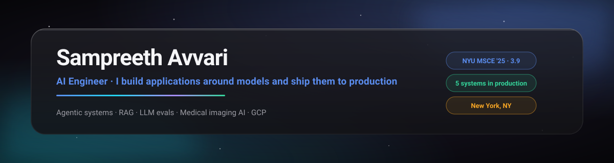

  

  
  
  
  

I'm an AI engineer at **Hybridge Implants** in New York. My job is the whole distance: take a fuzzy business problem, design the system, build the model pipeline, ship it on cloud infrastructure, and keep it alive with real users. Five of my systems run a dental implant company's daily operations today.

MS in Computer Engineering from **NYU**, May 2025, 3.9 GPA. Before that, backend audio analytics at **Shure** and enterprise AI infrastructure at **Optimal Living Systems**. Credited for data engineering in a 2026 *Telecommunications Policy* paper on intangible assets and state GDP.

---

### What I actually do with AI

Every line below is backed by something running in production, not a course certificate.

**Agentic AI and orchestration.** I build multi-step agent systems: tool use and function calling, MCP servers, headless LLM pipelines that plan, act, and verify. My job application agent screens postings, tailors materials against a locked profile, and applies with human review gates. My work journal agent sweeps 35 project folders twice a day, reads git diffs and session transcripts, and writes the day's engineering log by itself.

**RAG and retrieval.** Embeddings, pgvector, chunking strategy, and the part people skip: retrieval evaluation. My portfolio chatbot answers from a knowledge graph built over my own projects and writing. At work, an enterprise search system makes ten years of clinical documents answerable.

**LLM engineering.** Structured outputs enforced with JSON Schema, prompt design treated as an interface contract, hallucination measurement and reduction (minus 35% on our consultation QA pipeline), model evals wired into CI so quality regressions fail the build instead of reaching users.

**Fine-tuning and alignment.** SFT and RLHF (GRPO and PPO) with QLoRA and TRL on Llama 3.1 for NYU research on LLM persuasion; fine-tuned Llama 3 8B and RoBERTa on 1.8M tweets for misinformation work.

**Applied computer vision.** A production 3D medical imaging system: 13-class CBCT scan taxonomy, MONAI and PyTorch training, OpenVINO inference on Cloud Run, built in-house for under $50 a month against a $98K vendor quote.

**Platform and MLOps.** GCP end to end: Cloud Run, Cloud SQL, Pub/Sub, Eventarc, Vertex AI, Firestore. Docker, Kubernetes, Terraform, GitHub Actions with release gates, OpenTelemetry, MLflow, Weights & Biases. Systems earn their keep after the demo, so observability and CI/CD are part of the design, not an afterthought.

---

### Production systems I built and run

| System | What it does | Proof it matters |
|---|---|---|
| **Doc Coach** | Scores every implant consultation call against a 7-criterion clinical framework: Zoom to Gemini to coaching report, multi-tenant on Cloud Run | +130% treatment acceptance, +43% revenue, minus 35% hallucinations |
| **CBCT Scan Validator** | 3D medical imaging QA that catches bad scans before they cost a surgery slot | Replaced a $98K + $26K/yr vendor quote with under $50/mo on GCP |
| **Treatment Estimator** | Pricing engine with per-location catalogs and write-once price capture enforced by Postgres triggers | A 6-month price guarantee that is a database property, not a promise |
| **Cowork Dashboard** | Single source of truth for two clinics: six tabs sharing one metrics module, fed by a weekly pipeline | Patient to lead linkage jumped from 49% to 99% |
| **Ledger-Notes Verifier** | Cross-checks appointments, ledgers, and clinical notes and flags mismatches for the team | In weekly use, with team feedback shipped as versioned rule releases |

Architecture diagrams and the longer stories live on the [portfolio site](https://sampreethavvari.github.io).

---

### Stack

**Languages** Python, TypeScript, Go, Java, SQL
**AI/ML** PyTorch, Transformers, TRL, MONAI, OpenVINO, LangChain, pgvector, Gemini and Claude APIs, MCP
**Backend and web** FastAPI, Next.js, Node.js, Flask, Spring Boot, Postgres, Firestore
**Cloud and infra** GCP (Cloud Run, Cloud SQL, Pub/Sub, Eventarc, Vertex AI), AWS (S3, ECS, EC2), Docker, Kubernetes, Terraform, GitHub Actions
**Quality** OpenTelemetry, MLflow, Weights & Biases, JSON Schema validation, eval harnesses in CI

---

### How I work

- Spec before code. Tradeoffs and decisions live in the repo, not in someone's head.
- One source of truth. If two views can disagree on a number, they eventually will.
- Honest evals over green dashboards. Ship the real AUROC, never game the gate.
- Boring tech where it serves the user. A weekly Excel pipeline the team trusts beats a live dashboard nobody does.

---

### Off keyboard

I write, edit, and direct short films. Currently editing one. Equally happy arguing about story structure or system design.

  New York, NY · <a href="mailto:spa9659@nyu.edu">spa9659@nyu.edu</a> · <a href="https://sampreethavvari.github.io">sampreethavvari.github.io</a>

